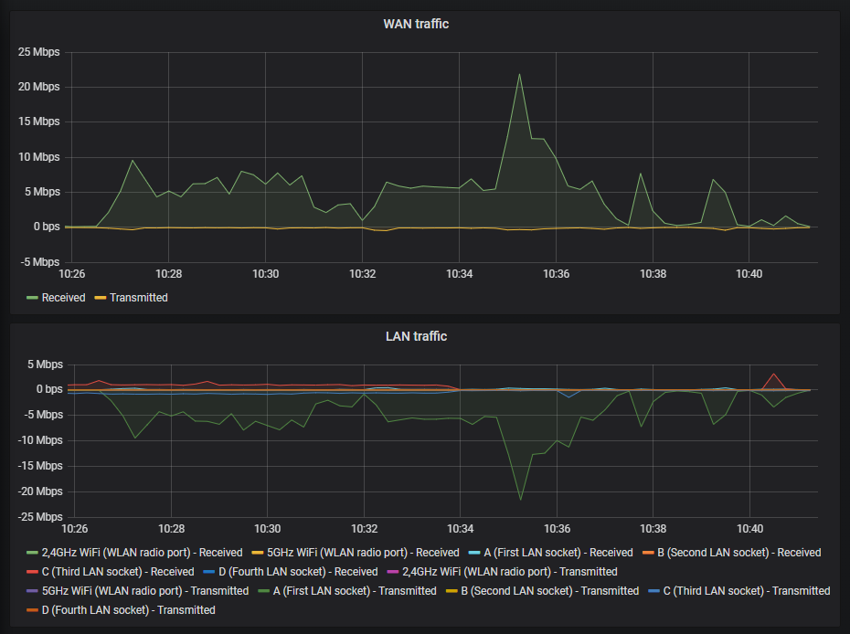

# hyperoptic_tilgin_exporter

Prometheus exporter for Tilgin HG238x devices.
Only tested with Hyperoptic firmware.



## Running

### Building from source

```shell script
git clone https://github.com/cheahjs/hyperoptic_tilgin_exporter.git
cd hyperoptic_tilgin_exporter
go build -o hyperoptic_tilgin_exporter github.com/cheahjs/hyperoptic_tilgin_exporter/cmd/hyperoptic_tilgin_exporter
ROUTER_PASSWORD=password ./hyperoptic_tilgin_exporter -username=admin -host=http://192.168.1.1 -listen-addr=:23465
```

### Docker

```shell script
docker run -e "ROUTER_PASSWORD=password" -p 23465:23465 deathmax/hyperoptic_tilgin_exporter -username=admin -host=http://192.168.1.1 -listen-addr=:23465
```

## Exported Metrics

```
# HELP tilgin_lan_rx_bytes Total bytes received on LAN interfaces
# TYPE tilgin_lan_rx_bytes counter
# HELP tilgin_lan_rx_packets Total packets received on LAN interfaces
# TYPE tilgin_lan_rx_packets counter
# HELP tilgin_lan_tx_bytes Total bytes sent on LAN interfaces
# TYPE tilgin_lan_tx_bytes counter
# HELP tilgin_lan_tx_packets Total packets sent on LAN interfaces
# TYPE tilgin_lan_tx_packets counter
# HELP tilgin_wan_rx_bytes Total bytes received on WAN interface
# TYPE tilgin_wan_rx_bytes counter
# HELP tilgin_wan_rx_packets Total packets received on WAN interface
# TYPE tilgin_wan_rx_packets counter
# HELP tilgin_wan_tx_bytes Total bytes sent on WAN interface
# TYPE tilgin_wan_tx_bytes counter
# HELP tilgin_wan_tx_packets Total packets sent on WAN interface
# TYPE tilgin_wan_tx_packets counter
```

## Known Issues

1. On firmware `ESx000-02_10_05_16`, the statistics for the 5GHz radio and clients are unavailable. 
